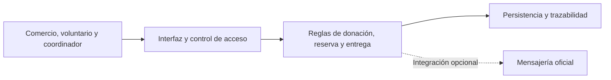

# Plan técnico del producto

Estado: documento de trabajo en revisión. La alternativa de referencia es No-Code/Low-Code con una posible integración oficial de WhatsApp Business. La plataforma, el proveedor de persistencia y el despliegue requieren una decisión técnica registrada antes de comprometer implementación.

## 1. Alternativa y decisiones

La alternativa busca reducir esfuerzo de mantenimiento y aprovechar canales conocidos por los participantes. Su aceptación depende de demostrar exclusión de reservas, control de acceso, recuperación ante fallos y un costo operativo viable. Bubble y Airtable aparecen como opciones de evaluación, no como una arquitectura ya implementada. P02 registra la decisión, sus criterios ponderados y las alternativas descartadas.

## 2. Componentes lógicos

La interfaz recoge datos y comunica resultados. Las reglas validan permisos, vigencia y transiciones. La persistencia debe garantizar una sola reserva activa por donación. La integración de mensajería no debe impedir completar el flujo principal cuando falle.

## 3. Modelo conceptual

| Entidad | Atributos mínimos | Restricción |
|---|---|---|
| Donación | ID, comercio, alimento, cantidad/unidad, lugar, hora límite, estado, autor, canal | ID único; cantidad positiva; hora límite válida al registrar |
| Reserva | ID, donación, voluntario, fecha/hora, clave de solicitud | Una única reserva vigente por donación; reintentos sin duplicidad |
| Entrega | ID, donación/reserva, organización receptora, fecha/hora, responsable | Un cierre válido por rescate; actor autorizado |
| Participante | ID, rol y datos mínimos de contacto | Acceso por rol y minimización de información |
| Evento | ID, donación, tipo, fecha/hora, actor | Historial consistente y auditable |

Estados de referencia: Disponible → Reservada → Entregada. Los eventos de recogida se conservan en la trazabilidad. La vigencia se evalúa antes de ofrecer o reservar; las excepciones requieren acuerdo del PO.

## 4. Integraciones y fallos

| Riesgo | Respuesta requerida | Actividad |
|---|---|---|
| Dos voluntarios reservan a la vez | Operación atómica o garantía equivalente demostrada; aviso al perdedor | SCRUM-24, SCRUM-25 |
| Se pierde la respuesta y el usuario reintenta | Identificador de solicitud y resultado repetible sin duplicados | SCRUM-26 |
| Consulta sin conexión | Diferenciar error de ausencia de resultados; permitir reintento | SCRUM-23 |
| Canal de mensajería no disponible | Mantener el registro y operación principal; registrar fallo | P02 |
| Costo o límite del proveedor | Estimar volumen y costo; documentar alternativa y límites | P02 |
| Exposición de datos privados | Acceso por rol y pruebas con usuarios diferenciados | SCRUM-30 |
| Baja familiaridad digital | Formularios mínimos y registro asistido trazable | SCRUM-18, SCRUM-21 |

## 5. Entorno, despliegue y revisión

P03 debe publicar instrucciones reproducibles y una URL validada con otro integrante. La documentación actual no acredita una aplicación desplegada ni un entorno ejecutable. Mantener secretos fuera del repositorio y definir separación entre datos de prueba y operación real.

Antes de iniciar desarrollo: aprobar criterios funcionales, seleccionar plataforma, demostrar exclusión atómica, definir roles y crear el entorno mínimo. Antes de cerrar una actividad: revisión independiente, prueba de aceptación, PR cuando corresponda y documentación actualizada.
