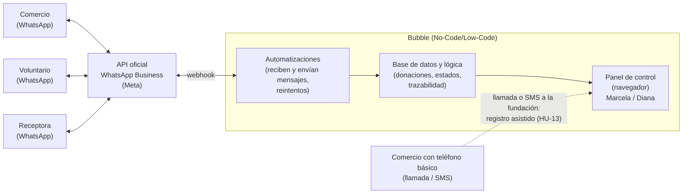

# Plan técnico — Rescate de Alimentos

**Fundación Mesa Común · Moreno and Company Technology · Proyecto Informático 2**

---

## 1. Alternativa seleccionada y cómo se sustenta

La alternativa seleccionada en el módulo 2 es la **Alternativa C: plataforma No-Code/Low-Code + WhatsApp Business API**. Consiste en no construir una aplicación nueva, sino ordenar la coordinación sobre el canal que comercios, voluntarios y receptoras ya usan: WhatsApp, conectado a la API oficial de WhatsApp Business. Detrás, una plataforma visual sin código (**Bubble**, una de las dos opciones planteadas en el módulo 2) guarda los datos, ejecuta las automatizaciones y ofrece un panel de control en el navegador para Marcela y Diana. Así se reemplazan los grupos de WhatsApp por un registro confiable, con trazabilidad y reportes para los cooperantes, sin servidores propios ni personal de TI. Se sustenta en lo siguiente:

- **Puntaje:** 119/130 (4,58/5) frente a 107 de la PWA y 56 de la app nativa con microservicios. Gana en los criterios de mayor peso: cumplimiento, factibilidad y satisfacción de las partes (5/5); costos, riesgos técnicos y escalabilidad obtienen 4/5.
- **Ataca el problema real:** el desorden está en los grupos de WhatsApp, no en la falta de una app. Comercios, voluntarios y receptoras siguen en el canal que ya conocen, con botones Sí/No en vez de texto libre, y las ventanas de pocas horas se protegen con avisos y plazos automáticos.
- **La opera la fundación:** Marcela y Diana administran todo desde un panel en el navegador, sin personal de TI, y el costo estimado cabe en los $150.000 mensuales (sección 5).
- **Brecha digital:** los 4 comercios con teléfono básico avisan por llamada o SMS y la fundación registra en su nombre (HU-13), con la misma trazabilidad.
- **Restricción asumida:** Meta exige plantillas pre-aprobadas para iniciar conversaciones fuera de la ventana de 24 h; se diseñan plantillas cortas y se envían a aprobación antes del piloto.

---

## 2. Arquitectura

*Figura 1. Arquitectura simplificada. La línea punteada es la ruta alterna para comercios sin WhatsApp.*

| Enlace | Cómo se comunican |
|---|---|
| Actores ↔ WhatsApp | Mensajes de WhatsApp: texto, botones de respuesta, listas y plantillas. Nadie instala nada. |
| Meta → Bubble | Webhook HTTPS (JSON) firmado. Bubble valida la firma, responde 200 de inmediato y procesa después. |
| Bubble → Meta | Las automatizaciones llaman a la API de Meta por HTTPS; el token vive como llave privada del conector. |
| Automatizaciones ↔ BD ↔ Panel | Internos a Bubble (flujos y consultas). Sin red intermedia que pueda fallar. |
| Informes y respaldo | Informe descargable (CSV/PDF) desde el panel para cooperantes y respaldo semanal en CSV a Google Drive. |

**Flujo principal.**

1. El comercio responde con botones: tipo de alimento, cantidad aproximada y hora límite.
2. Las automatizaciones crean la Donación con su ID de trazabilidad.
3. Ofrece el rescate a voluntarios compatibles (zona, día, vehículo); el primero que acepta recibe dirección, hora y cantidad.
4. La coordinadora confirma la receptora en el panel según refrigeración y capacidad: la decisión final es humana, para evitar casos como los 200 kg de tomate sin dónde guardar.
5. El voluntario confirma recogida y entrega con botones y la receptora reporta personas atendidas; cada paso queda como Evento.

---

## 3. Modelo de datos

| Entidad | Atributos principales | Notas |
|---|---|---|
| **Actor** | tipo (comercio · receptora · voluntario · operador), nombre, teléfono WhatsApp, canal (WhatsApp / llamada), estado (pendiente_consentimiento · activo · inactivo), fecha de consentimiento, zona y dirección. Receptora: refrigeración, puede recoger, capacidad kg. Voluntario: vehículo, días y franjas. | Teléfono único. Los actores no inician sesión: se identifican por su número. |
| **Donación** | id_trazabilidad (MC-AAAA-NNNN), comercio, categoría y descripción, kg estimados, kg reales, requiere frío, fecha de consumo preferente, hora límite, origen (directo / asistido), registrado_por, estado, creada_en. | ID único e inmutable. Origen «asistido» queda marcado para auditoría. |
| **Rescate** | donación, voluntario, receptora, kg entregados, personas atendidas, estado, horas de oferta, aceptación, recogida y entrega. | 1 donación → N rescates (si se reparte). |
| **Evento** | donación o rescate, tipo, estado anterior → nuevo, actor, canal, fecha-hora del mensaje según Meta. | Bitácora sanitaria: solo se inserta. |
| **Mensaje** | wamid, dirección (entrante / saliente), actor, plantilla, contenido, estado (en_cola · enviado · entregado · leído · fallido), intentos, próximo_reintento, error. | wamid único (evita duplicados). Es registro y cola. |
| **Informe · Parámetro** | Informe: periodo, kg totales, n.º rescates, n.º organizaciones, personas atendidas, generado_por. Parámetro: clave/valor (minutos de expiración de oferta, minutos para llamada de respaldo, reintentos). | El informe es foto fija: las cifras a cooperantes se pueden reproducir. |

**Estados de Donación:** `pendiente_registro` (nota de HU-13) → `publicada` → `asignada` → `en_tránsito` → `entregada` → `cerrada`; salidas: `vencida` (pasó la hora límite sin recogerse) y `cancelada`.

**Estados de Rescate:** `ofertado` → `aceptado` → `recogido` → `entregado`; salidas: `rechazado` o `expirado` (se ofrece al siguiente voluntario) y `fallido` (alimento no apto o no recibido, con motivo).

**Reglas:** la oferta expira a los 15 min y, si el comercio no confirma en 30 min, la coordinadora recibe alerta para llamar (valores iniciales, editables en Parámetro). La hora de cada Evento es la que reporta Meta, no la de llegada, así que una señal intermitente no altera la trazabilidad.

**Privacidad:** no se guardan datos individuales de beneficiarios, solo cantidad atendida; los teléfonos solo los ve el rol operador; el consentimiento queda registrado (Ley 1581 de 2012).

---

## 4. Integraciones y qué pasa si fallan

| Integración | Para qué | Si falla |
|---|---|---|
| WhatsApp → Bubble (webhook) | Recibir avisos y respuestas de botones. | Meta reintenta la entrega y los duplicados se descartan por wamid. Si Bubble está caído, el comercio puede llamar y se registra de forma asistida. |
| Bubble → WhatsApp (envío) | Ofertas, recordatorios y confirmaciones. | El mensaje queda en cola (tabla Mensaje) y se reintenta a 1, 5 y 15 min. Tras 3 intentos pasa a «fallido» y aparece como alerta en el panel para llamar por teléfono. |
| Plantillas y ventana de 24 h | Iniciar conversaciones con actores inactivos. | Si Meta rechaza o pausa una plantilla, se llama por teléfono mientras se corrige. Cada plantilla crítica tiene una versión alterna aprobada. |
| Interna (automatizaciones ↔ BD ↔ panel) | Flujo, datos y panel en una sola plataforma. | Si la plataforma cae: hoja compartida de contingencia en Drive; se carga después y los eventos conservan la hora real de Meta. |
| Enlace de mapa (sin API) | Mostrar el punto de recogida. | Es un enlace construido con la dirección. Si no abre, la dirección también va escrita en el mensaje. |
| Respaldo a Google Drive | Copia semanal en CSV. | Aviso por correo a las administradoras y exportación manual desde el panel. |

**Principio de degradación:** ante cualquier fallo se cae a llamada o SMS desde el teléfono de la fundación más registro asistido en el panel; la operación nunca depende de un único canal.

---

## 5. Entorno y despliegue

- **Dónde vive:** Bubble (nube gestionada, plan de pago) y la API Cloud de WhatsApp en Meta. Las cuentas quedan a nombre de la fundación, con Marcela y Diana como administradoras y verificación en dos pasos; el equipo entra como colaborador y sale al entregar. El alojamiento está fuera de Colombia y se informa en la política de tratamiento de datos.
- **Ambientes:** desarrollo (con número de prueba de Meta) y producción (número real). Se pasa a producción con una lista de chequeo de QA. El token de Meta y la clave de firma del webhook se guardan como llaves privadas, nunca en el navegador.
- **Cómo se levanta:**
  1. Cuenta Meta Business verificada y un número nuevo dedicado, distinto al que Marcela usa hoy en los grupos.
  2. Base de datos, roles y reglas de privacidad.
  3. Webhook y envío.
  4. Plantillas a aprobación (se inicia primero porque puede tardar días).
  5. Panel y registro asistido.
  6. Piloto con pocos comercios, 2 voluntarios y 1 receptora.
  7. Migración gradual desde los grupos.
- **Costo mensual estimado** (referencial; validar tarifas y TRM al contratar): plan de Bubble ≈ US$30 y mensajes de plantilla de Meta ≈ US$3–6 con 8–15 rescates semanales; total ≈ $130.000–145.000 COP (TRM ≈ 4.000). Se busca plan anual con tarifa fija, como se planteó en el módulo 2. El margen es estrecho, por eso las notificaciones se consolidan y el consumo se revisa cada mes.
- **Entrega y sostenibilidad:** manual de una página, lista semanal (mensajes fallidos, respaldo y consumo) y capacitación a Marcela y Diana.
